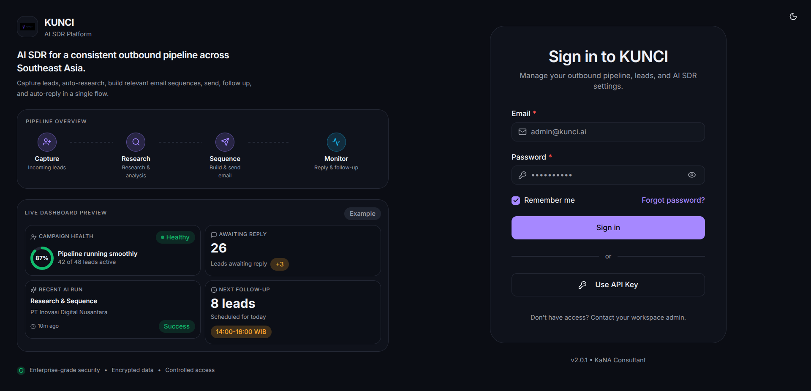
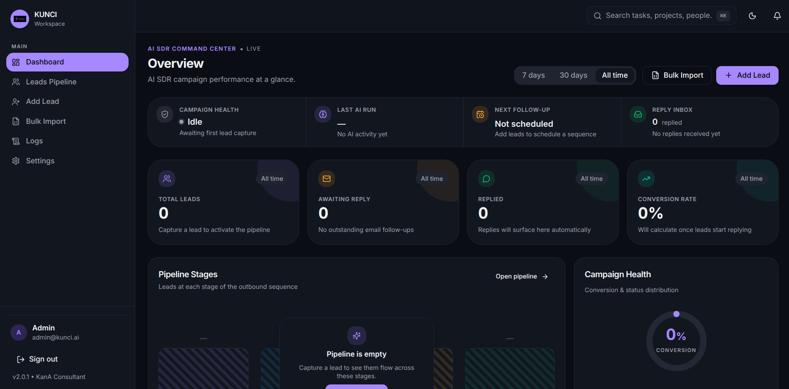
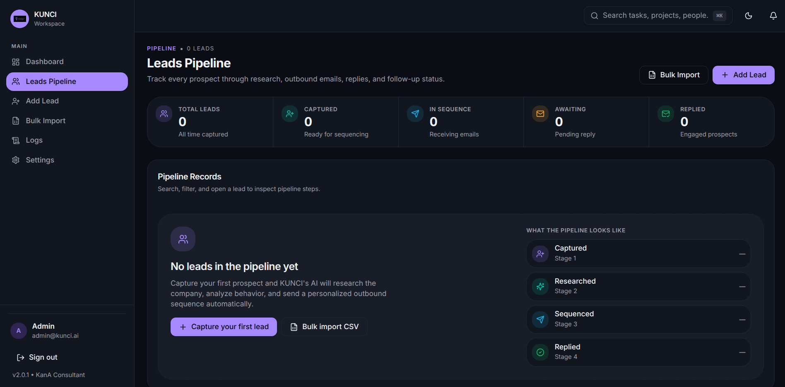
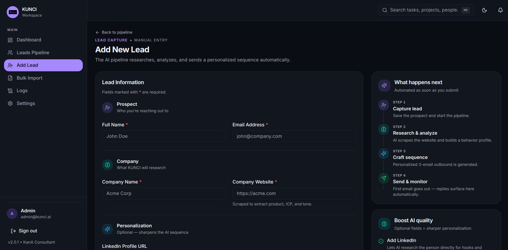
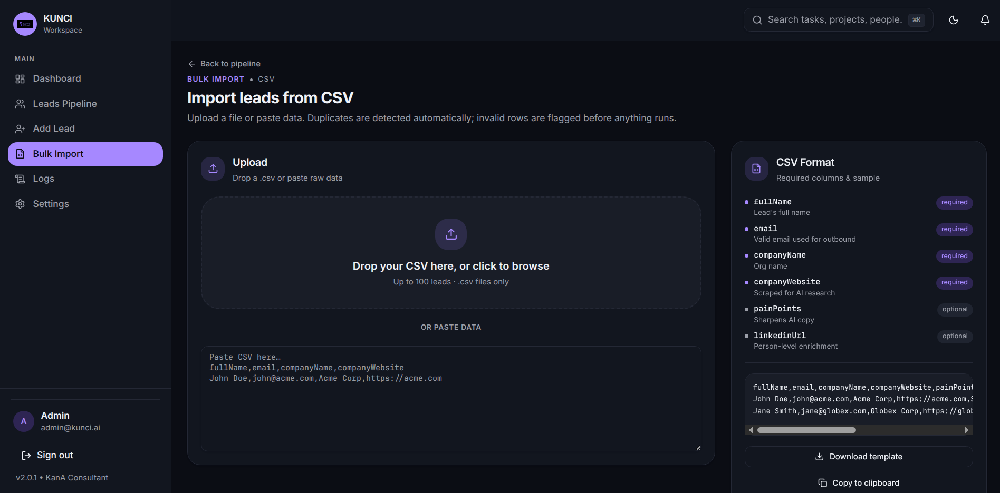
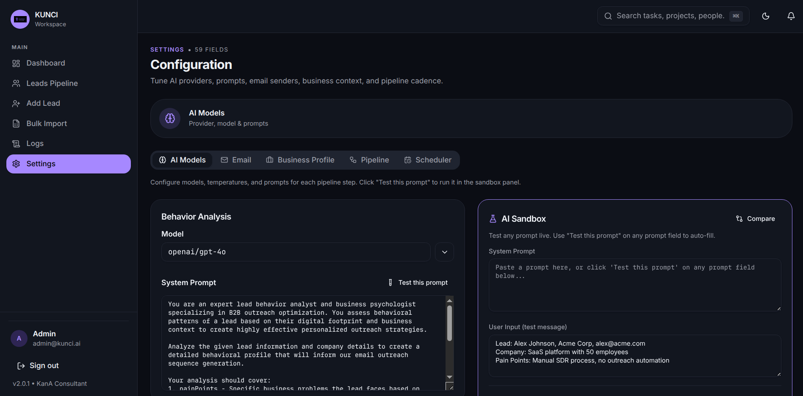

<p align="center">
  
  <br />
  <br />
  
  <br />
  <strong>AI-Powered Sales Development Representative</strong>
</p>

<p align="center">
  <a href="#features">Features</a> •
  <a href="#architecture">Architecture</a> •
  <a href="#getting-started">Getting Started</a> •
  <a href="#usage">Usage</a> •
  <a href="#tech-stack">Tech Stack</a> •
  <a href="#project-structure">Project Structure</a> •
  <a href="#production-deployment">Deployment</a> •
  <a href="#license">License</a>
</p>

<p align="center">
  
  
  
  
  
</p>

---

<p align="center">
  
</p>

### Screens

<table>
  <tr>
    <td width="50%"></td>
    <td width="50%"></td>
  </tr>
  <tr>
    <td align="center"><strong>Dashboard</strong><br/><sub>Campaign health, KPIs, pipeline stages</sub></td>
    <td align="center"><strong>Leads Pipeline</strong><br/><sub>Captured → Researched → Sequenced → Replied</sub></td>
  </tr>
  <tr>
    <td width="50%"></td>
    <td width="50%"></td>
  </tr>
  <tr>
    <td align="center"><strong>Add Lead</strong><br/><sub>Manual entry kicks off the 4-step AI pipeline</sub></td>
    <td align="center"><strong>Bulk Import</strong><br/><sub>CSV upload, duplicate detection, row validation</sub></td>
  </tr>
  <tr>
    <td colspan="2"></td>
  </tr>
  <tr>
    <td align="center" colspan="2"><strong>Settings</strong><br/><sub>Tune AI providers, prompts, senders, and pipeline cadence — with a live prompt sandbox</sub></td>
  </tr>
</table>

---

## What is KUNCI?

**KUNCI** is a fully autonomous AI Sales Development Representative (SDR) that automates outbound sales — from lead capture to personalized email conversations.

Instead of spending hours manually researching companies and crafting cold emails, KUNCI handles the entire pipeline automatically:

1. **Capture** a lead with basic info (name, email, company)
2. **Research** the company by scraping and analyzing their website
3. **Analyze** the lead's behavioral profile using AI
4. **Generate** a hyper-personalized 3-email nurturing sequence
5. **Send** emails on the optimal schedule
6. **Reply** intelligently when leads respond — keeping conversations going

All powered by LLMs through OpenRouter, with real email delivery via Resend.

---

## Features

- **Autonomous Pipeline** — One-click lead capture triggers the full research → analyze → generate → send workflow
- **8 Specialized AI Prompts** — Behavior analysis, website intelligence, email sequence generation, reply personalization, and more
- **3-Email Nurturing Sequences** — AI-generated with psychological triggers and multiple subject line variations
- **Auto-Reply Handling** — Webhook-driven reply detection with AI-personalized responses sent in the same email thread
- **Scheduled Follow-ups** — Cron-based daily follow-up processing at optimal send times
- **Dashboard** — Real-time stats on total leads, response rates, and conversion metrics
- **End-to-End Type Safety** — Shared types from API to frontend via oRPC
- **Clean Architecture** — Domain-driven design with ports & adapters for testability and modularity

---

## Architecture

KUNCI is a monorepo managed via **pnpm workspaces** and orchestrated by **Moonrepo**. It consists of four distinct workspace packages following Clean Architecture (ports & adapters):
- `apps/api`: Backend service (Hono + oRPC)
- `apps/web`: Frontend application (React + Vite)
- `apps/api-e2e`: Dedicated E2E testing environment for the API
- `apps/web-e2e`: Dedicated E2E testing environment for the Web

```
┌─────────────────────────────────────────────────────────┐
│                     Frontend (Web)                       │
│   React 19 • TanStack Router • Vite 6 • Kana UI Kit     │
│               oRPC Client (type-safe RPC)                │
└───────────────────────────┬─────────────────────────────┘
                            │ /rpc/*
┌───────────────────────────▼─────────────────────────────┐
│                      Backend (API)                       │
│                        Hono 4.7                          │
│                                                          │
│  ┌────────────────────────────────────────────────────┐  │
│  │               Presentation Layer                    │  │
│  │    oRPC Routers (lead, campaign)                    │  │
│  │    Webhook Handler (Resend)                         │  │
│  │    Middleware (public + protected procedures)       │  │
│  └────────────────────────┬───────────────────────────┘  │
│  ┌────────────────────────▼───────────────────────────┐  │
│  │               Application Layer                     │  │
│  │    pipeline/   — Outbound orchestrator              │  │
│  │    research/   — Scrape + AI analysis               │  │
│  │    email/      — Send initial, follow-up, reply     │  │
│  │    lead/       — Capture, list, detail               │  │
│  │    scheduler/  — Cron follow-up processor           │  │
│  │    shared/     — AppError, AuthedContext            │  │
│  │    use-cases.ts — Composition root (DI wiring)      │  │
│  └────────────────────────┬───────────────────────────┘  │
│  ┌────────────────────────▼───────────────────────────┐  │
│  │                  Domain Layer                       │  │
│  │    Entities:                                        │  │
│  │      Lead • EmailSequence • BehaviorAnalysis        │  │
│  │    Ports (interfaces):                              │  │
│  │      AIService • EmailService • ScraperService      │  │
│  │      Cache • Logger • EmailVerifier                 │  │
│  │    Repository interfaces:                           │  │
│  │      LeadRepository • EmailSequenceRepository       │  │
│  └────────────────────────┬───────────────────────────┘  │
│  ┌────────────────────────▼───────────────────────────┐  │
│  │              Infrastructure Layer                   │  │
│  │    ai/         — OpenRouter (native fetch, 7 prompts)│  │
│  │    email/      — Resend SDK                         │  │
│  │    scraper/    — Deepcrawl SDK                      │  │
│  │    db/         — Drizzle ORM + PostgreSQL            │  │
│  │    cache/      — Redis (ioredis)                     │  │
│  │    scheduler/  — Croner (cron jobs)                  │  │
│  │    observability/ — Pino (structured logging)       │  │
│  │    email-verification/ — DNS MX validation          │  │
│  │    config/     — Zod-validated environment           │  │
│  └────────────────────────────────────────────────────┘  │
└──────────────────────────────────────────────────────────┘
          │              │              │              │
     PostgreSQL 17    Redis 7    OpenRouter API    Resend API
```

### Pipeline Flows

**Flow 1 -- Outbound (Lead to Email):**
```
Capture Lead (+ MX verify)
  -> Scrape Website (Deepcrawl)
  -> AI Website Analysis (P3: o3-mini)
  -> AI Company Profile (P4: gpt-4.1-mini)
  -> AI Behavior Analysis (P1: gpt-4o)
  -> AI Generate 3-Email Sequence (P2: gpt-4o-mini)
  -> AI Convert to HTML (P5: gpt-4o-mini)
  -> AI Pick Subject Line (P8: gpt-4o-mini)
  -> Send via Resend
  -> Track in DB
```

**Flow 2 -- Reply Handling (Webhook to Auto-Reply):**
```
Resend Webhook (email.replied / email.received)
  -> Find Lead by email
  -> Get next sequence template
  -> AI Personalize Reply (P6/P7: o3-mini)
  -> AI Convert to HTML (P5: gpt-4o-mini)
  -> Reply in thread via Resend
  -> Update lead stage + status
```

**Flow 3 -- Scheduled Follow-ups (Cron):**
```
Daily 09:30 UTC
  -> Find leads with status=awaiting, stage<=2, last email >4 days ago
  -> For each: send next email in sequence
```

---

## Getting Started

### Prerequisites

- **Node.js** ≥ 20
- **pnpm** ≥ 9
- **Docker** (for PostgreSQL and Redis)

### 1. Clone the repository

```bash
git clone https://github.com/kana-consultant/kunci.git

cd kunci
```

### 2. Install dependencies

```bash
pnpm install
```

### 3. Start infrastructure

```bash
docker compose -f docker-compose.dev.yml up -d
```

This starts:
- **PostgreSQL 17** on `localhost:5432`
- **Redis 7** on `localhost:6399`

### 4. Configure environment

```bash
cp .env.example .env
```

Edit `.env` with your API keys:

| Variable | Description | Required |
|---|---|---|
| `DATABASE_URL` | PostgreSQL connection string | Yes |
| `REDIS_URL` | Redis connection string | Yes |
| `OPENROUTER_API_KEY` | [OpenRouter](https://openrouter.ai) API key for LLM access | Yes |
| `RESEND_API_KEY` | [Resend](https://resend.com) API key for email delivery | Yes |
| `RESEND_WEBHOOK_SECRET` | Webhook signature verification secret | Optional |
| `SENDER_EMAIL` | Verified sender email address | Yes |
| `SENDER_NAME` | Sender display name | Yes |
| `DEEPCRAWL_API_KEY` | [Deepcrawl](https://deepcrawl.com) API key for web scraping | Yes |
| `LINKEDIN_CRAWLING_PERMISSION_CONFIRMED` | Enables permission-gated LinkedIn crawl attempts. Keep `false` unless LinkedIn has explicitly approved your crawl scope. | Optional |
| `PORT` | API server port (default: `3005`) | Optional |
| `WEB_ORIGIN` | Frontend URL for CORS and auth origin checks (default: `http://localhost:5418`) | Optional |

### 5. Initialize the database

```bash
pnpm db:push
```

### 6. Start development servers

```bash
# Start both API and Web concurrently
pnpm dev

# Or start individually
pnpm dev:api   # API on http://localhost:3005
pnpm dev:web   # Web on http://localhost:5418
```

---

## Usage

### Adding a Lead

1. Navigate to `http://localhost:5418/capture`
2. Fill in the lead's details (name, email, company, website)
3. Click **"Capture Lead"**
4. The AI pipeline runs automatically in the background

### Monitoring

- **Dashboard** (`/`) — Overview stats: total leads, awaiting replies, replied, conversion rate
- **Leads Pipeline** (`/leads`) — Full lead list with stage and status filters
- **Lead Detail** (`/leads/:id`) — Individual lead progress and email history

### Webhook Setup (for reply handling)

To enable automatic reply handling, configure a Resend webhook pointing to:

```
POST https://your-domain.com/webhooks/resend
```

Subscribe to `email.replied` and `email.received` events.

#### UAT Scenario: "Inbound Email triggers AI Auto-Reply"

**Prerequisites:**
1. Backend running in an internet-accessible environment (or use `ngrok` for local: `ngrok http 3005`).
2. Add `https://<ngrok-url>/webhooks/resend` in Resend Dashboard -> Webhooks.
3. Check events: `email.received` and `email.replied`.
4. Copy *Webhook Secret* to `.env`: `RESEND_WEBHOOK_SECRET=whsec_...`

**Test Steps:**
1. Open KUNCI Frontend (`/capture`).
2. Input Lead data with **your real email** (so you can reply to it).
3. Click **"Capture & Run Pipeline"**.
4. Wait ~30s for the first email to arrive in your inbox.
5. **Reply** to that email from your email client. Example: *"Interesting, how much does it cost?"*

**Expected Results:**
1. **Server Logs:** Should show `Received Resend Webhook` and `Personalizing reply via AI`.
2. **Dashboard:** Lead `Reply Status` changes from `replied` to `awaiting`, and `Stage` increases.
3. **Inbox:** You receive an automated AI response in the same thread.


---

## Monorepo & Tooling

To ensure high code quality, consistent development environments, and fast builds, this project utilizes modern developer tooling designed specifically for monorepos:

| Tool | Role |
|---|---|
| [pnpm Workspaces](https://pnpm.io/workspaces) | Manages monorepo dependencies and local package linking efficiently. |
| [Moonrepo](https://moonrepo.dev/) | Smart task runner and build system (`.moon/`). It orchestrates cross-project tasks and aggressively caches outputs (like typechecking or testing) to speed up CI/CD. |
| [Biome](https://biomejs.dev) | Unified, lightning-fast linter and formatter, replacing ESLint and Prettier. |
| [Vitest](https://vitest.dev) | Next-generation testing framework used in our dedicated `*-e2e` workspaces to keep production code clean. |
| [Husky](https://typicode.github.io/husky/) | Manages Git hooks to enforce quality checks (`pre-push`) before code is pushed to the repository. |

---

## Tech Stack

### Backend

| Technology | Role |
|---|---|
| [Hono](https://hono.dev) | Ultrafast web framework |
| [oRPC](https://orpc.unnoq.com) | End-to-end type-safe RPC |
| [Drizzle ORM](https://orm.drizzle.team) | Type-safe SQL ORM |
| [PostgreSQL](https://postgresql.org) | Primary database (4 tables: leads, email_sequences, behavior_analyses, activity_log) |
| [Redis](https://redis.io) (via ioredis) | Caching layer |
| [OpenRouter](https://openrouter.ai) | Multi-model LLM gateway (native fetch, no SDK) |
| [Resend](https://resend.com) | Transactional email delivery + webhook events |
| [Deepcrawl](https://github.com/nicepkg/deepcrawl) | Website scraper (open-source Firecrawl alternative) |
| [Pino](https://getpino.io) | Structured JSON logging |
| [Croner](https://github.com/Hexagon/croner) | Lightweight cron scheduler |
| [Zod](https://zod.dev) | Runtime validation (env + oRPC input schemas) |

### Frontend

| Technology | Role |
|---|---|
| [React 19](https://react.dev) | UI library |
| [Vite 6](https://vite.dev) | Build tool and dev server |
| [TanStack Router](https://tanstack.com/router) | Type-safe file-based routing |
| [TanStack Query](https://tanstack.com/query) | Server state management |
| [@kana-consultant/ui-kit](https://github.com/kana-consultant/kana-ui-kit) | Radix-based design system (OKLCH tokens, Tailwind v4) |
| [Tailwind CSS 4](https://tailwindcss.com) | Utility-first styling |
| [Lucide](https://lucide.dev) | Icon library |

### AI Prompts (via OpenRouter)

| ID | Task | Model |
|---|---|---|
| P1 | Behavior Analysis | `openai/gpt-4o` |
| P2 | Email Sequence Generation | `openai/gpt-4o-mini` |
| P3 | Website Analysis | `openai/o3-mini` |
| P4 | Company Profile | `openai/gpt-4.1-mini` |
| P5 | HTML Conversion | `openai/gpt-4o-mini` |
| P6/P7 | Reply Personalization | `openai/o3-mini` |
| P8 | Subject Line Selection | `openai/gpt-4o-mini` |

---

## Project Structure

```
kunci/
├── .moon/                         # Moonrepo configuration for task orchestration
├── apps/
│   ├── api/                           # Backend (Hono + oRPC)
│   │   ├── src/
│   │   │   ├── domain/                # Pure business types (no framework deps)
│   │   │   │   ├── lead/              # Lead entity, LeadRepository interface
│   │   │   │   ├── email-sequence/    # EmailSequence entity + repository interface
│   │   │   │   ├── behavior-analysis/ # BehaviorAnalysis entity
│   │   │   │   └── ports/             # Service interfaces (AIService, EmailService,
│   │   │   │                          #   ScraperService, Cache, Logger, EmailVerifier)
│   │   │   ├── application/           # Use cases (orchestration logic)
│   │   │   │   ├── pipeline/          # runOutboundPipeline (main orchestrator)
│   │   │   │   ├── research/          # researchCompany (scrape + AI analysis)
│   │   │   │   ├── email/             # sendInitialEmail, sendFollowup, handleReply
│   │   │   │   ├── lead/              # captureLead, listLeads, getLeadDetail
│   │   │   │   ├── scheduler/         # processPendingFollowups
│   │   │   │   ├── shared/            # AppError, AuthedContext
│   │   │   │   └── use-cases.ts       # Composition root (DI wiring)
│   │   │   ├── presentation/          # HTTP boundary
│   │   │   │   ├── routers/           # oRPC routers (lead, campaign)
│   │   │   │   └── orpc/              # Context type, public/protected middleware
│   │   │   ├── infrastructure/        # External service adapters
│   │   │   │   ├── ai/                # OpenRouter adapter + 7 prompt templates
│   │   │   │   ├── db/                # Drizzle schema, client, repositories
│   │   │   │   ├── email/             # Resend adapter
│   │   │   │   ├── scraper/           # Deepcrawl adapter
│   │   │   │   ├── cache/             # Redis adapter
│   │   │   │   ├── scheduler/         # Croner cron setup
│   │   │   │   ├── observability/     # Pino logger
│   │   │   │   ├── email-verification/# DNS MX verifier
│   │   │   │   └── config/            # Zod-validated env vars
│   │   │   ├── main.ts                # Server bootstrap (DI + Hono + scheduler)
│   │   │   └── index.ts               # AppRouter type export (for web)
│   │   └── drizzle.config.ts          # Drizzle Kit config
│   │
│   └── web/                           # Frontend (React + Vite)
│       └── src/
│           ├── routes/                # TanStack Router file-based pages
│           │   ├── __root.tsx         # DashboardShell layout (Sidebar + TopBar)
│           │   ├── index.tsx          # Dashboard (stats overview)
│           │   ├── capture.tsx        # Lead capture form
│           │   └── leads/
│           │       ├── index.tsx      # Lead pipeline table
│           │       └── $leadId.tsx    # Lead detail (contact + research + timeline)
│           ├── libs/
│           │   └── orpc/client.ts     # oRPC client setup (type-safe via @kunci/api)
│           └── styles.css             # Tailwind + Kana UI Kit theme imports
│
│   ├── api-e2e/                       # Dedicated API testing workspace (Vitest)
│   └── web-e2e/                       # Dedicated Web testing workspace (Vitest)
│
├── Dockerfile                         # Multi-stage production build (hardened)
├── docker-compose.dev.yml             # Dev infrastructure (PostgreSQL + Redis)
├── docker-compose.yml            # Production stack (API + DB + Redis)
├── .dockerignore                      # Build context exclusions
├── .env.production.example            # Production env template
├── biome.json                         # Biome linter and formatter config
├── tsconfig.base.json                 # Shared TypeScript config
├── pnpm-workspace.yaml                # Monorepo workspace definition
└── package.json                       # Root scripts (dev, build, db, lint, test)
```

---

## Production Deployment

### Quick Start

```bash
# 1. Create production environment file
cp .env.production.example .env.production
# Edit .env.production with real credentials

# 2. Build and start
docker compose -f docker-compose.yml up -d --build

# 3. Push database schema
docker compose -f docker-compose.yml exec api \
  node -e "import('#/infrastructure/db/client.ts').then(m => m.pushSchema())"
```

### Docker Architecture

The `Dockerfile` uses a **6-stage multi-stage build** to produce a minimal, secure image:

| Stage | Purpose | Base |
|---|---|---|
| `base` | Shared base with pnpm + tini | `node:22-alpine` |
| `deps` | Install all dependencies (dev + prod) | base |
| `build-api` | Compile API with tsup | deps |
| `build-web` | Build React frontend with Vite | deps |
| `prod-deps` | Install production-only dependencies | base |
| `runtime` | Final image with only compiled output | `node:22-alpine` |

The final image contains **no source code, no devDependencies, and no build tools**.

### Security Hardening

The production stack applies the following hardening measures:

**Container-level:**
- Non-root user (`kunci:1001`) for the API process
- `read_only: true` root filesystem on all containers
- `cap_drop: ALL` with minimal capabilities re-added where needed
- `no-new-privileges` security option to prevent privilege escalation
- `tini` as PID 1 for proper SIGTERM/SIGINT signal forwarding
- Tmpfs mounts with `noexec,nosuid` for `/tmp`
- Resource limits (memory + CPU) on every service

**Database (PostgreSQL):**
- `scram-sha-256` authentication (no trust auth)
- No port exposed to the host by default (internal network only)
- Read-only root filesystem with tmpfs for runtime dirs
- Shared memory set to 128MB via `shm_size`

**Cache (Redis):**
- Dangerous commands disabled: `FLUSHALL`, `FLUSHDB`, `DEBUG`, `CONFIG`
- `protected-mode yes` enabled
- Memory capped at 128MB with LRU eviction
- Persistence disabled (cache-only, not a data store)
- No port exposed to host

**Logging:**
- JSON file driver with 10MB max size, 3 file rotation
- Pino structured JSON logging from the API

**Secrets:**
- `.env.production` is gitignored
- `POSTGRES_PASSWORD` is **required** (compose fails without it)
- All API keys validated at startup via Zod schema

### Health Checks

| Service | Endpoint/Command | Interval | Start Period |
|---|---|---|---|
| API | `GET /healthz` | 30s | 15s |
| PostgreSQL | `pg_isready -U kunci -d kunci` | 10s | 30s |
| Redis | `redis-cli ping` | 10s | 10s |

---

## Available Scripts

| Script | Description |
|---|---|
| `pnpm dev` | Start both API and Web dev servers |
| `pnpm dev:api` | Start API server only |
| `pnpm dev:web` | Start Web dev server only |
| `pnpm build` | Build both apps for production |
| `pnpm db:generate` | Generate Drizzle migrations |
| `pnpm db:push` | Push schema changes to database |
| `pnpm db:studio` | Open Drizzle Studio (DB GUI) |
| `pnpm lint` | Run Biome linter across all packages |
| `pnpm test` | Run Vitest tests across all packages |
| `pnpm typecheck` | TypeScript type checking |

---

## API Reference

### oRPC Procedures (via `/rpc/*`)

| Procedure | Auth | Input | Description |
|---|---|---|---|
| `lead.capture` | Public | `{ fullName, email, companyName, companyWebsite, painPoints?, leadSource? }` | Capture lead and trigger full AI pipeline |
| `lead.list` | Protected | `{ page, limit, stage?, status? }` | List leads with pagination and filters |
| `lead.getDetail` | Protected | `{ id }` | Get full lead detail |
| `campaign.getStats` | Protected | — | Dashboard statistics |

### HTTP Endpoints

| Method | Path | Description |
|---|---|---|
| `GET` | `/healthz` | Liveness probe |
| `GET` | `/ready` | Readiness probe (Redis connectivity) |
| `POST` | `/webhooks/resend` | Resend webhook receiver |

---

## Contributing

Contributions are welcome! Please follow these steps:

1. Fork the repository
2. Create a feature branch (`git checkout -b feature/amazing-feature`)
3. Commit your changes (`git commit -m 'feat: add amazing feature'`)
4. Push to the branch (`git push origin feature/amazing-feature`)
5. Open a Pull Request

### Code Style

This project uses [Biome](https://biomejs.dev) for linting and formatting:
- **Indent**: Tabs
- **Quotes**: Double
- **Semicolons**: As needed

---

## License

This project is licensed under the MIT License — see the [LICENSE](LICENSE) file for details.

---

<p align="center">
  Built by <a href="https://github.com/kana-consultant">KanA Consultant</a>
</p>
