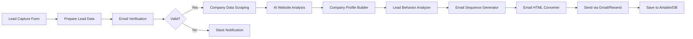

# QA Audit: KUNCI Codebase vs Standards

> **Auditor:** AI QA Engineer
> **Date:** 2026-04-28
> **Scope:** Full codebase audit against `kana-best-practice-engineering`, `kana-ui-kit`, `AI_Email_Lead_Nurturing_System.json`, `PROJECT.md`, and learning guides.

---

## Executive Summary

| Category | Score | Verdict |
|---|---|---|
| **Architecture (Clean/Hexagonal)** | 🟢 9/10 | Excellent — follows `kana-monorepo-fullstack-typescript` skill closely |
| **Tech Stack Compliance** | 🟢 9/10 | Vite + TanStack Router + Hono + oRPC + Drizzle — matches spec exactly |
| **UI Kit Integration** | 🟡 5/10 | `@kana-consultant/ui-kit` installed + CSS imported, but **zero components used** |
| **n8n Workflow Parity** | 🟢 8/10 | All major pipeline nodes implemented natively |
| **Best Practice Compliance** | 🟡 7/10 | Good foundation, several gaps documented below |
| **Completeness** | 🟡 6/10 | Core pipeline functional, but missing features & polish |

### Overall Verdict: **🟡 NOT YET COMPLETE — ~70% done**

---

## 1. Architecture Compliance

### ✅ PASS — Clean Architecture Layers

The codebase correctly implements the hexagonal architecture from `kana-monorepo-fullstack-typescript`:

```
apps/api/src/
  domain/          ✅ Pure types + ports (no framework imports)
  application/     ✅ Use-cases via factories: makeX(deps) → async fn
  infrastructure/  ✅ Concrete adapters (drizzle, redis, openrouter, resend, deepcrawl)
  presentation/    ✅ oRPC routers + middleware
```

**Evidence:**
- [domain/ports/](file:///home/nekofi/workspace/strata/kunci/apps/api/src/domain/ports) — 5 clean interfaces (AIService, Cache, EmailService, EmailVerifier, ScraperService)
- [application/use-cases.ts](file:///home/nekofi/workspace/strata/kunci/apps/api/src/application/use-cases.ts) — `buildUseCases(deps)` factory pattern ✅
- [infrastructure/config/env.ts](file:///home/nekofi/workspace/strata/kunci/apps/api/src/infrastructure/config/env.ts) — Zod-validated env ✅
- Domain has **zero** framework imports ✅

### ⚠️ FINDING: Domain imports infrastructure logger

```
apps/api/src/application/lead/capture-lead.ts:5
  import { logger } from "#/infrastructure/observability/logger.ts"
```

**All 6 application files** import directly from `infrastructure/observability/logger.ts`. Per the skill: *"Domain must not import from infrastructure"*. Application layer should also avoid direct infrastructure imports — logger should be injected or use a port.

**Affected files:**
- `application/lead/capture-lead.ts`
- `application/email/send-email.ts`
- `application/email/handle-reply.ts`
- `application/pipeline/run-outbound-pipeline.ts`
- `application/research/research-company.ts`
- `application/scheduler/process-followups.ts`

**Severity:** 🟡 Medium — violates layer boundary rule #2 & #3 from the skill

---

## 2. Tech Stack Compliance

### ✅ PASS — Stack matches PROJECT.md spec exactly

| Required (from chat) | Implemented | Status |
|---|---|---|
| Vite | `vite@^6.0.0` | ✅ |
| TanStack (Router) | `@tanstack/react-router@^1.0.0` | ✅ |
| Hono | `hono@^4.7.0` | ✅ |
| oRPC | `@orpc/server@^1.4.0` + `@orpc/client` | ✅ |
| Drizzle ORM | `drizzle-orm@^0.39.0` | ✅ |
| OpenRouter (3rd party) | Native fetch to `openrouter.ai/api/v1` | ✅ |
| Resend (email) | `resend@^4.1.0` SDK | ✅ |
| Deepcrawl (scraping) | `deepcrawl@^0.1.0` SDK | ✅ |
| TypeScript (native AI) | No AI framework — pure fetch | ✅ |
| pnpm monorepo | `pnpm-workspace.yaml` with `apps/*` | ✅ |
| Biome | `biome.json` configured | ✅ |
| TanStack Query | `@tanstack/react-query@^5.0.0` | ✅ |
| Tailwind v4 | `tailwindcss@4.0.0` + `@tailwindcss/vite` | ✅ |

### ⚠️ FINDING: Missing `moon` workspace tooling

The skill specifies `moon + pnpm workspaces`. The project has `.moon/` directory but root `package.json` uses pnpm filter scripts instead of moon tasks. This is a minor deviation — the pattern still works.

---

## 3. n8n Workflow Parity (AI_Email_Lead_Nurturing_System.json)

### Pipeline Node Mapping



| n8n Node | KUNCI Implementation | Status |
|---|---|---|
| Lead Capture Form | `presentation/routers/lead.ts` → `capture` | ✅ |
| Prepare Lead Data | `application/lead/capture-lead.ts` | ✅ |
| Email Verification (Reoon) | `infrastructure/email-verification/mx-verifier.ts` (DNS MX) | ✅ Better — zero deps |
| Company Data Scraping (Apify) | `infrastructure/scraper/deepcrawl-service.ts` | ✅ |
| LinkedIn Scraping (Apify) | ❌ **NOT IMPLEMENTED** | ❌ Missing |
| AI Website Analysis (P3) | `openrouter-service.ts` → `analyzeWebsite()` | ✅ |
| Company Profile Builder (P4) | `openrouter-service.ts` → `buildCompanyProfile()` | ✅ |
| Lead Behavior Analyzer (P1) | `openrouter-service.ts` → `analyzeBehavior()` | ✅ |
| Email Sequence Generator (P2) | `openrouter-service.ts` → `generateEmailSequence()` | ✅ |
| Email HTML Converter (P5) | `openrouter-service.ts` → `convertToHtml()` | ✅ |
| Subject Line Picker (P8) | `openrouter-service.ts` → `pickSubjectLine()` | ✅ |
| Send via Gmail | `infrastructure/email/resend-service.ts` | ✅ Resend instead |
| Save to Airtable | `infrastructure/db/` (PostgreSQL + Drizzle) | ✅ Better |
| Reply Personalizer (P6/P7) | `openrouter-service.ts` → `personalizeReply()` | ✅ |
| Follow-up Scheduler | `infrastructure/scheduler/cron.ts` (croner) | ✅ |
| Webhook Handler | `main.ts` → `/webhooks/resend` | ✅ |
| Slack Notification | ❌ **NOT IMPLEMENTED** | ❌ Missing |

### Missing from n8n workflow:
1. **LinkedIn Company/Profile Scraping** — n8n flow scrapes LinkedIn data for enrichment
2. **Slack Notifications** — n8n notifies on invalid emails
3. **Follow-Up Stage 2 (AI-Powered Final Nudge)** — flow exists in image but no distinct logic
4. **Inbound Email Processing** — partially done via webhook, but not as robust as the n8n flow

---

## 4. Kana UI Kit Compliance

### ❌ FAIL — UI Kit installed but NOT USED

**Evidence:**
- [web/package.json](file:///home/nekofi/workspace/strata/kunci/apps/web/package.json#L13) — `"@kana-consultant/ui-kit": "latest"` ✅ installed
- [styles.css](file:///home/nekofi/workspace/strata/kunci/apps/web/src/styles.css#L2) — `@import "@kana-consultant/ui-kit/styles"` ✅ tokens imported
- **BUT: Zero UI Kit components used anywhere in the codebase**

All frontend pages use raw HTML elements with Tailwind classes instead of the kit's components:

| Should Use (Kana UI Kit) | Currently Uses | File |
|---|---|---|
| `<DashboardShell>` + `<Sidebar>` + `<TopBar>` | Manual `<aside>` + `<header>` + `<nav>` | `__root.tsx` |
| `<StatCard>` | Raw `<div>` with Tailwind | `index.tsx` |
| `<Button>` | Raw `<button>` with Tailwind | `capture.tsx` |
| `<Input>`, `<Label>`, `<Textarea>` | Raw `<input>`, `<label>`, `<textarea>` | `capture.tsx` |
| `<Card>`, `<CardHeader>`, `<CardContent>` | Raw `<div>` wrappers | All pages |
| `<Badge>` | Raw `<span>` with pill classes | `leads/index.tsx` |
| `<useAppForm>` + `<TextField>` | Manual `useState` + raw inputs | `capture.tsx` |
| `<ThemeToggle>` | Not present at all | — |
| `<ActivityFeed>` | Not present | `leads/$leadId.tsx` |
| `<TaskCard>` / `<KanbanColumn>` | Not present | — |

**Severity:** 🔴 High — This was an explicit requirement from PROJECT.md

---

## 5. Best Practice Compliance Checklist

### From `kana-monorepo-fullstack-typescript` Skill

| Rule # | Rule | Status | Notes |
|---|---|---|---|
| 1 | Web imports types only from `@saas/api` | ✅ | `@kunci/api` exports only `AppRouter` type |
| 2 | Domain stays framework-free | ⚠️ | Domain OK, but Application imports infrastructure logger |
| 3 | Use-cases take deps as parameter | ✅ | All use `makeX(deps)` pattern |
| 4 | All inputs validated with Zod at oRPC boundary | ✅ | `captureLeadSchema`, list/detail schemas |
| 5 | Authorization at two places | ❌ | `protectedProcedure` is **mocked** (`isAuthenticated = true`) |
| 6 | Audit log mutations via activityRepo | ❌ | `activityLog` table exists in schema but **never written to** |
| 7 | Invalidate cache in write use-cases | ❌ | Cache exists but **never used** in any use-case |
| 8 | Never edit `routeTree.gen.ts` | ✅ | In biome ignore list |
| 9 | Migrations source-controlled | ✅ | `drizzle/` folder exists |
| 10 | Use `.ts` extensions in imports | ✅ | Consistently applied |

### From `clean-code` Skill

| Practice | Status | Notes |
|---|---|---|
| No `any` types | ❌ | Multiple `any` casts in pipeline deps, web pages, oRPC client |
| Single Responsibility | ✅ | Each use-case file has focused responsibility |
| Error handling | ⚠️ | Good try/catch patterns, but inconsistent status recovery |
| Biome lint rules | ✅ | Properly configured with recommended rules |

---

## 6. Critical Bugs & Issues

### 🔴 BUG-001: Authentication is completely mocked

```typescript
// presentation/orpc/middleware.ts:19
const isAuthenticated = true // Mocked for now
```

The `protectedProcedure` always passes. Any unauthenticated user can access `lead.list`, `lead.getDetail`, and `campaign.getStats`.

### 🔴 BUG-002: `@ts-nocheck` in oRPC client

```typescript
// apps/web/src/libs/orpc/client.ts:1
// @ts-nocheck
```

This disables ALL TypeScript checking for the oRPC client, defeating the purpose of the typed end-to-end oRPC integration.

### 🔴 BUG-003: Excessive `as any` casts in frontend

Every oRPC call in the web app uses `(orpc as any)`:
- `index.tsx:25` — `(orpc as any).campaign.getStats.queryOptions()`
- `capture.tsx:24` — `(orpc as any).lead.capture.mutationOptions()`
- `leads/index.tsx:30` — `(orpc as any).lead.list.queryOptions()`
- `leads/$leadId.tsx:25` — `(orpc as any).lead.getDetail.queryOptions()`

This means **zero type safety** on the frontend oRPC calls.

### 🟡 BUG-004: `any` types in pipeline deps

```typescript
// application/pipeline/run-outbound-pipeline.ts:6-7
captureLead: (input: any) => Promise<Lead>
researchCompany: (lead: Lead) => Promise<any>
```

### 🟡 BUG-005: Cache never utilized

`Redis` cache is initialized in `main.ts` and passed to services, but **no use-case reads from or writes to cache**. Company research results, AI analyses, etc. are never cached despite having the infrastructure ready.

### 🟡 BUG-006: `activityLog` table unused

The schema defines `activityLog` table but no repository or use-case writes to it. Per the skill: *"Audit log mutations via activityRepo.insert inside the use-case"*.

### 🟡 BUG-007: Lead detail page doesn't show email sequences

`leads/$leadId.tsx` has a placeholder saying *"The AI is currently crafting the sequence"* but never actually fetches or displays the email sequences. There's no oRPC endpoint to fetch sequences for a lead.

### 🟡 BUG-008: Missing `jobTitle` field

The n8n workflow captures `Job Title` but the KUNCI domain entity and capture form have no `jobTitle` field.

---

## 7. Missing Features

| Feature | Priority | Effort |
|---|---|---|
| **Actually use Kana UI Kit components** | 🔴 High | Medium — replace raw HTML in all routes |
| **Real authentication** (better-auth or at minimum basic auth) | 🔴 High | Medium |
| **Fix oRPC client type safety** (remove `@ts-nocheck` + `as any`) | 🔴 High | Small |
| **Activity logging** (write to `activityLog`) | 🟡 Medium | Small |
| **Cache utilization** (company research, AI results) | 🟡 Medium | Small |
| **Email sequence display** on lead detail page | 🟡 Medium | Medium |
| **LinkedIn enrichment** (from n8n workflow) | 🟡 Medium | Medium |
| **Dark mode support** (ThemeToggle from UI Kit) | 🟢 Low | Small |
| **Slack/notification integration** | 🟢 Low | Small |
| **Job Title field** in lead entity + form | 🟢 Low | Small |
| **Pagination** on leads page (currently hardcoded limit: 50) | 🟢 Low | Small |
| **Lead detail → email sequence timeline** endpoint + UI | 🟡 Medium | Medium |

---

## 8. What's Done Well

1. **Clean Architecture** — Properly layered with ports & adapters pattern
2. **Tech Stack** — Exactly matches the `vite + tanstack + hono` specification from the team chat
3. **AI Service** — 8 AI prompts with structured JSON schemas, retry logic, rate limit handling
4. **Pipeline Orchestration** — Full capture→research→analyze→generate→send flow
5. **Follow-up Scheduler** — Cron job with 4-day wait correctly implemented
6. **Reply Handling** — Webhook + AI personalization for inbound replies
7. **Email Threading** — Proper `In-Reply-To` / `References` headers for thread continuity
8. **Graceful Degradation** — Deepcrawl has fallback to basic fetch scraping
9. **Environment Validation** — Zod schema with clear error messages
10. **Database Schema** — Well-structured with proper FK relationships and cascades

---

## 9. Completion Assessment

### By Reference Document

| Reference | Compliance | Missing |
|---|---|---|
| `kana-best-practice-engineering` | 🟡 70% | Auth, activity log, cache usage, logger port |
| `kana-ui-kit` | 🔴 20% | All UI components need migration to kit |
| `AI_Email_Lead_Nurturing_System.json` | 🟢 80% | LinkedIn scraping, Slack notifications |
| `PROJECT.md` requirements | 🟡 75% | UI kit usage, LinkedIn enrichment |
| Learning guides | 🟢 85% | Matches pipeline flow and timing rules |

### Estimated Remaining Work

| Task | Effort |
|---|---|
| Migrate all UI to Kana UI Kit | 4-6 hours |
| Fix oRPC type safety | 1-2 hours |
| Add real authentication | 2-4 hours |
| Activity logging + cache usage | 2-3 hours |
| Email sequence display endpoint + UI | 2-3 hours |
| Polish & remaining features | 3-4 hours |
| **Total estimated** | **~14-22 hours** |

---

## 10. Recommendation

> [!IMPORTANT]
> The **backend architecture is solid and production-ready in structure**. The critical gaps are:
> 1. **Frontend must migrate to Kana UI Kit** — this was an explicit project requirement
> 2. **Fix type safety** — remove `@ts-nocheck` and `as any` casts
> 3. **Authentication cannot ship as mocked** — even basic auth is needed
>
> Once these 3 items are addressed, the project is shippable as V1.
